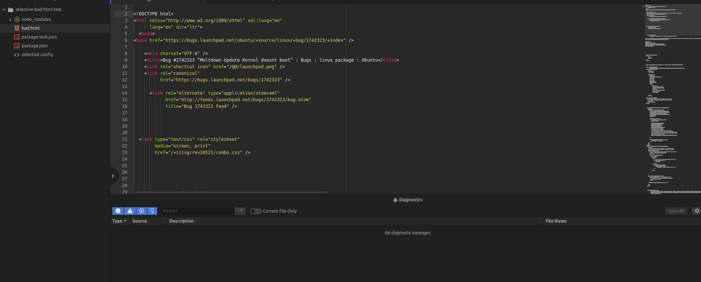

# Selective Atom Plugin

[](https://atom.io/packages/linter-selective)
[](https://travis-ci.org/ChristianMurphy/selective)
[](https://ci.appveyor.com/project/ChristianMurphy/selective/branch/master)

> Use CSS selectors to find HTML anti-patterns

```bash
apm install linter-selective
```



## References

* [Selective](https://github.com/ChristianMurphy/selective)
* [Atom Linter](https://atom.io/packages/linter)
* [Rehype](https://github.com/rehypejs/rehype)
* [CSS Selectors](https://developer.mozilla.org/en-us/docs/web/css/css_selectors)
